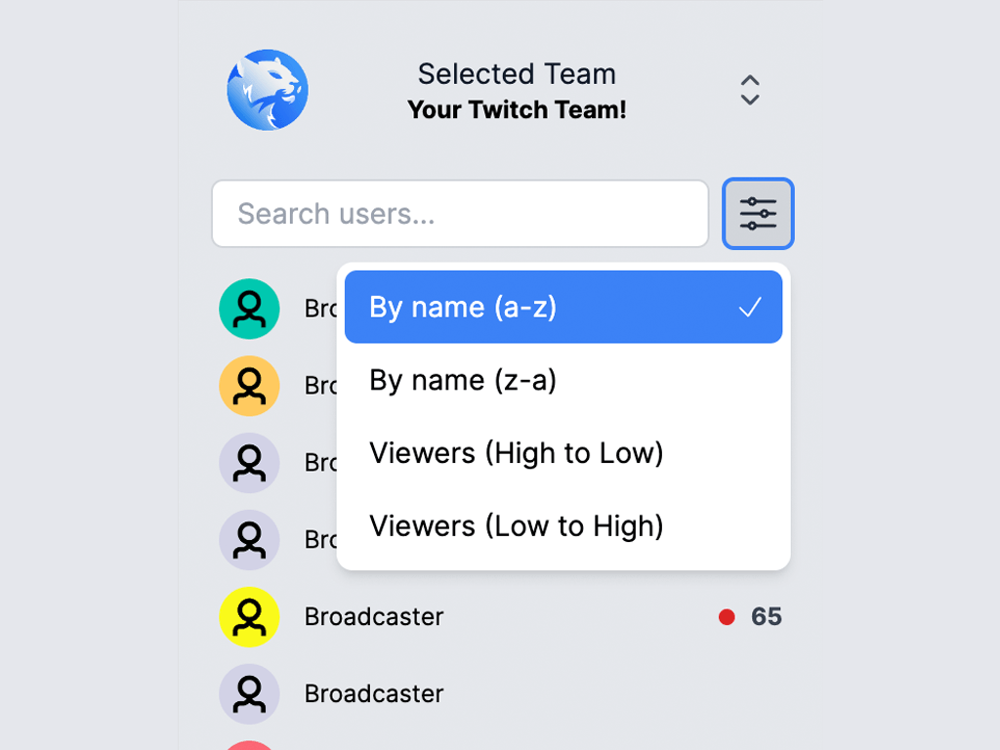

# team-members-extension

> A Twitch extension to display all users who are in a Twitch stream in a panel, and their viewership (if they're live).

**[This extension is live on Twitch!](https://dashboard.twitch.tv/extensions/3ot63weux43j9va0jy0th37wm2yjlz)**

This extension is written in Web Components using [Lit](https://lit.dev), and makes all of its data calls through the [public Twitch API](https://dev.twitch.tv/docs/api).

## Packaging

In order to have the extension live on Twitch, there's some manual steps you need to take (uploading ZIP file to [TwitchDev console](https://dev.twitch.tv/console)), and sharing the source code when asked by the review team as our source is built using Vite.

For your convenience, there's a helper script: `./package.sh`. When ran, it'll build the app, and create two zip files in the `out` directory for you:

- `package.zip`: The contents to upload to the TwitchDev console.
- `source.zip`: All files required for the review team to build, review and run the code. It excludes heavy, unneeded directories like `.git` and `node_modules`.
